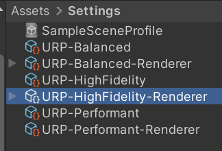

# EquiCam

This fork has been updated to work exclusively with Unity's Universal Render Pipeline (URP). Tested on Unity 2022.

1.  Attach the `EquiCam.cs` script to your main Camera object.

2.  **Assign the Material:** Drag `Material/Spherical` or `Material/TinyPlanet` into the `Equi Material` slot on the `EquiCam` component.

3.  **Add the Render Feature:**
    *   Find the **URP Renderer Asset**. `Project Settings > Graphics > Scriptable Render Pipeline Settings`, and click on the Renderer asset in the list. Then select the URp-Renderer.asset.
    *   In the Renderer's Inspector, click **"Add Renderer Feature"** and select **"Equi Cam Render Feature"** from the list.

- This effect runs as a custom render pass. It likely won't be compatible with URP's standard Volume post-processing effects, as it hijacks the final screen output.
  
---

Realtime 360° Camera for Unity
Place the script on your camera to transform it into a realtime 360° panorama renderer. 
This may degrade performance quickly! It uses 6 camera's to render to a cubemap in the background.   
-Works in Forward and Deferred rendering  
-Does not support most image effects

